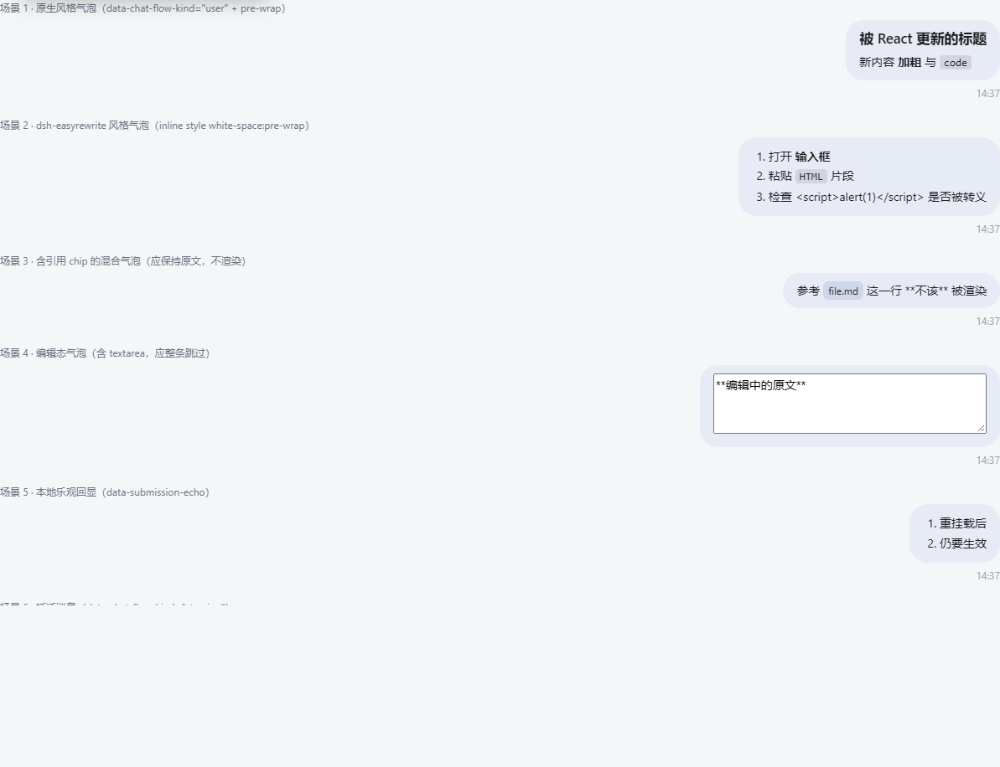
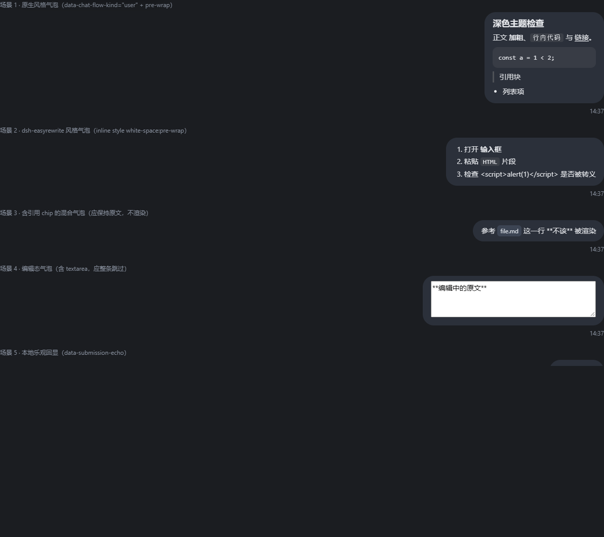

# dsh-user-markdown

**让 DeepSeek Harness Web GUI 里「用户自己发出的消息」也按 Markdown 渲染。**

> A zero-dependency, build-free DSH client plugin that renders the user's own outgoing messages as Markdown in the DeepSeek Harness Web GUI.

[](LICENSE)


DSH 只在**模型回复**里渲染 Markdown；用户自己的消息永远以纯文本（`white-space: pre-wrap`）显示，
写出去的 `**重点**`、`` `命令` ``、`- 列表`、代码块到了气泡里就变成字面符号。
本插件补上这一半：用户气泡现在和模型气泡一样被渲染。

| | |
| --- | --- |
| **安装前** | `## 标题` / 正文 `**加粗**` 与 `` `code` `` / `` ``` 代码块 ``` |
| **安装后** | 标题（h2 样式）· 正文 **加粗** 与 `code`（行内代码样式）· 代码块（等宽 + 底色） |

---

## 目录

- [它解决什么问题](#它解决什么问题)
- [特性](#特性)
- [效果预览](#效果预览)
- [安装](#安装)
- [使用](#使用)
- [支持的 Markdown 语法](#支持的-markdown-语法)
- [换行语义（重要）](#换行语义重要)
- [与其它插件的兼容性](#与其它插件的兼容性)
- [工作原理](#工作原理)
- [已知限制](#已知限制)
- [常见问题](#常见问题)
- [开发与测试](#开发与测试)
- [更新日志](#更新日志)
- [许可](#许可)

---

## 它解决什么问题

```
你输入的                      你在气泡里看到的（默认）
─────────────────────────    ────────────────────────────────
## 结论                      ## 结论
                             
- 步骤一                     - 步骤一
- 步骤二                     - 步骤二

`npm run build` 即可。       `npm run build` 即可。
```

同一段文字，发给模型时模型看得懂，但你自己回头看历史记录时得在脑子里"预编译"一遍。
本插件把这一层补上，只动展示层。

## 特性

- **渲染用户消息** —— 持久消息、插话（steering）、乐观回显气泡全部生效。
- **零依赖、零构建** —— `lib/client.js` 是手写的自包含 bundle（约 25 KB），不引任何第三方库，不需要打包步骤。
- **不抢槽位、不打架** —— 不注册 `conversation.chat.node`，因此**不会覆盖** `dsh-easyrewrite`、`dsh-rewind-plugin` 之类的气泡渲染器（详见[兼容性](#与其它插件的兼容性)）。
- **不碰数据** —— 不改会话、不改配置、不动模型上下文；加载/卸载只影响浏览器端展示。
- **XSS 安全** —— 所有文本先 HTML 转义，链接走协议白名单，`<script>` 只会显示成字面文本。
- **深浅色主题自适配** —— 用中性半透明色，不写死配色。
- **一行开关** —— 控制台 `window.__dshUserMarkdown.toggle()` 即可临时停用。

## 效果预览





> 图片来自本仓库自带的浏览器验证台（`test/harness.html`），它用与真实 GUI 相同的 DOM 约定复刻了
> 原生气泡、easyrewrite 风格气泡、编辑态、含引用 chip 的混合气泡等场景。

## 安装

**前置条件**：`dsh` 可执行、`pnpm` 在 PATH 上（`dsh plugin` 内部转发给 pnpm）。

### 从本地克隆安装（推荐）

```bash
git clone <repo-url> dsh-user-markdown

# 把 <插件目录的绝对路径> 换成真实路径
dsh plugin --profile web add "link:<插件目录的绝对路径>"
```

Windows PowerShell 示例：

```powershell
git clone <repo-url> dsh-user-markdown
dsh plugin --profile web add "link:$((Get-Location).Path)\dsh-user-markdown"
```

`link:` 前缀让 pnpm 建一个指向克隆目录的**软链**（不是拷贝），所以以后 `git pull` 或改源码后
**只要重启 `dsh web` 就生效**，不用重新安装。

这条命令做三件事：

1. 把本包作为依赖装进 `~/.dsh/profiles/web`；
2. 识别到本包声明了 `dsh.bundle.patch`，自动把 `dsh-user-markdown` 追加进
   `~/.dsh/profiles/web/package.json` 的 `dsh.profile.bundles`；
3. 下次启动 profile 时，本插件的 `cordis.patch.yml` 会把自己的条目插进装配树。

最后**重启 DSH**：

```bash
dsh web
```

### 验证是否装上

```bash
# 装配树里应出现一行 dsh-user-markdown
dsh --profile web --dump-config | grep dsh-user-markdown
```

```powershell
# Windows
dsh --profile web --dump-config | Select-String dsh-user-markdown
```

打开 GUI 后，在 DevTools 控制台确认客户端半侧已挂载：

```js
typeof window.__dshUserMarkdown        // "object"
window.__dshUserMarkdown.enabled()     // true
```

### 备选：手工链接（不想动 pnpm 时）

```powershell
# 1) 链接进 profile 的 node_modules
New-Item -ItemType Junction `
  -Path   "$env:USERPROFILE\.dsh\profiles\web\node_modules\dsh-user-markdown" `
  -Target "<插件目录的绝对路径>"

# 2) 手工把 "dsh-user-markdown" 加进 ~/.dsh/profiles/web/package.json
#    的 dsh.profile.bundles 数组

# 3) 重启 dsh web
```

> 之后再跑 `pnpm install` 时 pnpm 可能会清理掉这个手工 junction —— 遇到就用上面的 `dsh plugin add`。

### 卸载

```bash
dsh plugin --profile web remove dsh-user-markdown
# 然后重启 dsh web
```

## 使用

装上即生效，**无需任何配置**。

### 临时开关（浏览器侧，立即生效）

```js
window.__dshUserMarkdown.disable()          // 恢复原文显示
window.__dshUserMarkdown.enable()           // 重新渲染
window.__dshUserMarkdown.toggle()
window.__dshUserMarkdown.refresh()          // 强制重扫一次（排查用）
window.__dshUserMarkdown.render('# 测试')   // 直接试用渲染器
```

开关状态存在 `localStorage['dsh-user-markdown:enabled']`（`'0'` 表示停用），刷新页面后依然有效。

### 整插件停用（配置侧）

在 `~/.dsh/profiles/web/cordis.patch.yml` 追加：

```yaml
- id: dsh-user-markdown
  name: 'dsh-user-markdown'
  disabled: true
```

## 支持的 Markdown 语法

| 语法 | 说明 |
| --- | --- |
| `#` ~ `######` | 标题（1–6 级） |
| `**粗体**` `*斜体*` `***粗斜***` `~~删除线~~` | 行内强调 |
| `` `行内代码` `` / 三个反引号的围栏代码块 | 代码（保留缩进与原样字符，不做高亮） |
| `[文本](https://…)` / 裸 `https://…` | 链接（新标签打开） |
| `-` `*` `+` / `1.` | 无序、有序列表 |
| `>` | 引用块 |
| `---` | 分隔线 |
| `\| a \| b \|` + `\|---\|---\|` | 表格 |
| `` | 图片（http/https 与相对路径） |
| 段内换行 | 按硬换行（`<br>`）处理 —— 聊天场景下最符合书写直觉，精确语义见下一节 |

**安全**：所有文本先 HTML 转义；链接走协议白名单（`http(s)` / `mailto` / `tel` / 相对路径 / `#`），
`javascript:` 与 `data:` 会被降级为 `#`；`<script>`、`onerror=` 之类只会显示成字面文本。

## 换行语义（重要）

DSH 的用户消息文本里**确实会出现孤立回车符 `\r`**（粘贴、输入法等来源都可能带进来）。
它在浏览器里有个反直觉的行为，本插件严格复刻这一行为，不做任何"自作主张"的规范化：

| 源文本里的字符 | `white-space: pre-wrap` 下的表现 |
| --- | --- |
| `\n` | 换行 |
| `\r\n` | 换行（算一个） |
| 孤立 `\r` | **不换行、被直接忽略**（Chromium 实测：`'A\rB'` 的渲染宽度 === `'AB'`） |
| `\n\n` | 两个换行（Markdown 里 = 分段） |

也就是说：一条存储上看起来"被拆成三行"的文本，实际渲染出来可能只有两行 ——
**本插件渲染前后的行结构完全一致**，它只把 Markdown 标记变成样式，不会改变原文的换行布局。

> 这正是 v1.0.1 修复的回归：v1.0.0 的渲染器把孤立 `\r` 也当成了换行，于是含 `\r` 的历史消息
> 会被额外撑开、行内代码的反引号被拆散（表现为"这条消息的 Markdown 突然不渲染了"）。

如果你在输入框里看到换行、消息发出后却没换行，来源就是那个不可见的 `\r`。
它属于 composer / 粘贴源的问题，不在本插件职责范围内（插件只做展示层），但你可以据此定位。

## 与其它插件的兼容性

本插件**不注册 `conversation.chat.node` 槽位**，因此不会顶掉任何人的气泡渲染器。

| 场景 | 结果 |
| --- | --- |
| 原生 DSH 气泡 | ✅ 渲染 |
| 启用 [`dsh-easyrewrite`](https://github.com/Renzic-Stone/DSH-EasyRewrite)（替换了 user 节点渲染器、自带撤回/重编辑） | ✅ 渲染，撤回/编辑不受影响 |
| 启用 [`dsh-rewind-plugin`](https://github.com/SiriLee/dsh-rewind) | ✅ 渲染 |
| 两者**同时**启用 / **都**禁用 | ✅ 渲染 |
| 未来任何插件替换 user 气泡渲染器 | ✅ 只要沿用 DSH 的 DOM 约定，就继续渲染 |

## 工作原理

DSH 的用户气泡由 `conversation.chat.node` 这个 **keyed slot** 的 `user` / `steering` 渲染器产出，
而它是**替换语义**：任何注册同一个 key 的插件都会把原生渲染器整体顶掉。本插件若去抢注这个槽位，
就会和 easyrewrite / rewind 之类的插件互相覆盖。

所以这里走 **DOM 增强层**：

```
会话事件 ──▶ React 渲染用户气泡 ──▶ MutationObserver
                                        │
                                        ▼
                          找出"纯文本消息体"容器
                                        │
                                        ▼
                     插入渲染后的 Markdown DOM（原文本节点清空）
```

谁渲染的气泡都无所谓 —— 原生、easyrewrite 替换版、未来任何插件版，只要文本落进 DOM 就能生效。
三条安全边界（源码 `lib/client.js` 顶部有完整注释）：

1. **只处理「除文本节点外没有其它元素子节点」的容器** —— 含 `@文件` 引用 chip、附件块、
   额外内容块（`JsonBlock`）的消息**保持原文**，绝不打断别的插件写进去的结构；
2. **只处理 `white-space: pre-wrap / pre-line / break-spaces` 的元素** —— 这是"纯文本消息体"的天然判据，
   时间戳、按钮、操作区因此自动被排除；
3. **编辑态整条跳过** —— 气泡里出现 `textarea` / `input` / `contenteditable` 时不下手，
   所以 easyrewrite 的"气泡重编辑"不会和本插件打架；退出编辑后内容一变会自动重新渲染。

实现细节：只清空文本节点的 `nodeValue`、只追加自己的 `div`，**不删除、不包裹 React 拥有的节点**，
因此 React 后续更新不会抛错；文本一变（React 写回 `nodeValue`）或子树被重建，
MutationObserver 都会重新渲染。

## 已知限制

- **含引用 chip / 附件块的消息不渲染**：这类气泡里除了文本还有别的元素节点，本插件选择不介入
  （宁可不渲染，也不把结构搞坏）。纯文本消息不受影响。
- **只影响 Web GUI**：终端（TUI / ACP）里不生效，那里本来也不渲染 Markdown。
- **依赖 DSH 的 DOM 约定**：`data-chat-flow-kind="user" | "steering"`、`data-submission-echo`、
  `data-pending-steering`。若将来 DSH 改了这些属性名，插件会**静默失效**（不报错、不影响其它功能），
  届时改一行选择器即可。
- **不做语法高亮**：代码块只有等宽字体 + 底色，不引第三方高亮库（为了保持零依赖、零构建）。

## 常见问题

<details>
<summary><b>装上后完全没反应？</b></summary>

1. 确认插件进了装配树：`dsh --profile web --dump-config | grep dsh-user-markdown`；
2. 确认 `~/.dsh/profiles/web/package.json` 的 `dsh.profile.bundles` 里有它（`dsh plugin add` 会自动写）；
3. 确认**重启过** `dsh web`；
4. 浏览器控制台执行 `typeof window.__dshUserMarkdown` —— 不是 `"object"` 说明客户端半侧没加载，
   检查浏览器控制台的报错与 `lib/client.js` 是否被正确提供（`/plugins/**` 请求）。
</details>

<details>
<summary><b>只有一部分消息被渲染？</b></summary>

含 `@文件` 引用 chip、附件块或额外内容块的气泡会被刻意跳过（见[已知限制](#已知限制)）。
纯文本消息全部会渲染。
</details>

<details>
<summary><b>改了源码没生效？</b></summary>

`link:` 安装时只需重启 `dsh web`（浏览器强刷一次 `Ctrl/Cmd+Shift+R` 更稳妥）。
若用 `pnpm install` 之后插件消失，说明手工 junction 被清理了 —— 改用 `dsh plugin add`。
</details>

<details>
<summary><b>会不会把消息内容改坏 / 影响发给模型的内容？</b></summary>

不会。插件只操作浏览器 DOM 的展示层，不写会话、不改配置、不碰请求内容；
模型收到的仍然是原文。
</details>

## 开发与测试

```
dsh-user-markdown/
├── package.json          # dsh.bundle.patch + dsh.client.platform=web
├── cordis.patch.yml      # 装配层：把插件条目插进 profile 树
├── lib/
│   ├── index.js          # 宿主半侧（最小化：只为让 client bundle 进入启动图）
│   └── client.js         # 浏览器半侧：Markdown 渲染器 + DOM 增强（自包含，零依赖）
├── test/
│   ├── run-tests.mjs     # 渲染器单元测试（纯 Node，无需浏览器）
│   ├── serve.mjs         # 本地静态服务器
│   └── harness.html      # 浏览器验证台（复刻原生 / easyrewrite 气泡、编辑态、混合内容、CR 回归）
└── assets/               # README 截图
```

```bash
# 单元测试（22 条：语法、转义、XSS、协议白名单、换行语义、幂等）
node test/run-tests.mjs

# 浏览器验证台：真实 DOM + MutationObserver + getComputedStyle 的行为验证
node test/serve.mjs        # → http://127.0.0.1:3460/test/harness.html
```

`lib/client.js` 是**手写的自包含 bundle**（`window.__ModuleLoader__.load({ id, factory })` 形式），
不需要任何构建步骤，改完直接重启 DSH 即可。

## 更新日志

### v1.0.1

- **修复**：换行语义与浏览器 `white-space: pre-wrap` 逐字符对齐 —— 孤立 `\r` 不再被当成换行。
  此前含 `\r` 的消息会被额外撑开、行内代码的反引号被拆散。附带 2 条回归测试与验证台场景 8。

### v1.0.0

- 首次发布：用户消息、插话消息、乐观回显的 Markdown 渲染；DOM 增强层方案；
  22 条单元测试与浏览器验证台。

## 许可

[MIT](LICENSE)
